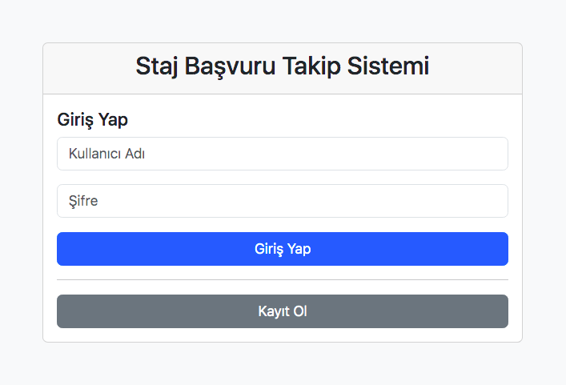
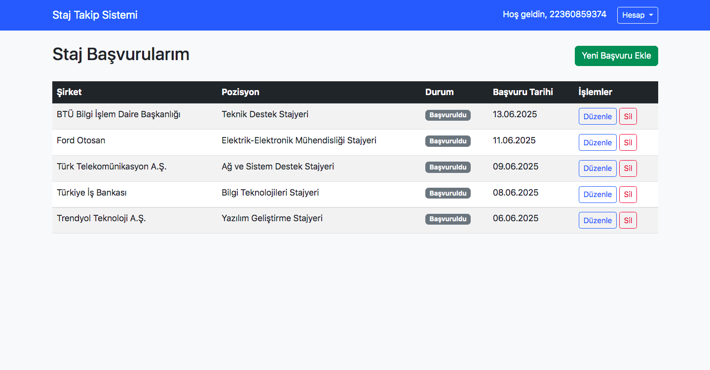

# Staj Başvuru Takip Sistemi

Bu proje, öğrencilerin staj başvurularını düzenli bir şekilde takip etmelerini sağlayan web tabanlı bir uygulamadır. Kullanıcılar başvurdukları şirketleri ve pozisyonları kolayca yönetebilirler.

## Proje Amacı

Öğrencilerin staj başvuru sürecinde karşılaştıkları en büyük sorunlardan biri, hangi şirkete ne zaman başvurduklarını ve başvurularının hangi aşamada olduğunu takip etmektir. Bu sistem, bu sorunu çözerek öğrencilerin staj arama sürecini daha organize hale getirmeyi amaçlar.

## Özellikler

### Kullanıcı Yönetimi
- **Güvenli Kayıt Sistemi**: Şifreler hash'lenerek saklanır
- **Session Tabanlı Giriş**: Güvenli oturum yönetimi
- **Hesap Silme**: Kullanıcılar hesaplarını tamamen silebilir

### Başvuru Yönetimi
- **Başvuru Ekleme**: Yeni staj başvurularını sisteme kaydetme
- **Başvuru Listeleme**: Tüm başvuruları düzenli tablo halinde görüntüleme
- **Başvuru Düzenleme**: Mevcut başvuru bilgilerini güncelleme
- **Başvuru Silme**: Artık gerekmeyen başvuruları kaldırma

## Teknolojiler

- **Backend**: PHP (framework kullanılmamıştır)
- **Veritabanı**: MySQL
- **Frontend**: HTML5, CSS3, JavaScript
- **CSS Framework**: Bootstrap 5.3.0
- **Güvenlik**: Password Hashing, Sessions

## Dosya Yapısı

```
── config.php          # Veritabanı bağlantısı ve genel ayarlar
── index.php           # Ana sayfa (giriş/kayıt formu)
── login.php           # Giriş işlemi
── register.php        # Kayıt işlemi
── logout.php          # Çıkış işlemi
── dashboard.php       # Ana panel (başvuruları listeleme)
── add.php             # Yeni başvuru ekleme
── edit.php            # Başvuru düzenleme
── delete.php          # Başvuru silme
── delete_account.php  # Hesap silme
```

## Kullanım

### 1. Web Tarayıcısında Açma
[Staj Başvuru Takip Sistemi](http://95.130.171.20/~st22360859374/)   

### 2. Hesap Oluşturma
- Ana sayfada "Kayıt Ol" butonuna tıklayın
- Kullanıcı adı, e-posta ve şifre bilgilerinizi girin
- Kayıt işlemi tamamlandıktan sonra otomatik olarak giriş yapılır

### 3. Başvuru Ekleme
- Dashboard'da "Yeni Başvuru Ekle" butonuna tıklayın
- Şirket adı, pozisyon, başvuru tarihi ve notları girin
- "Başvuru Ekle" butonuna tıklayarak kaydedin

### 4. Başvuru Yönetimi
- Başvurularınızı dashboard'da tablo halinde görüntüleyin
- "Düzenle" butonu ile başvuru bilgilerini güncelleyin
- "Sil" butonu ile gereksiz başvuruları kaldırın

## Demo Video

[Demo Video - Staj Başvuru Takip Sistemi](https://youtu.be/i5z-z704ijk)

## Ekran Görüntüleri

### Ana Sayfa - Giriş/Kayıt Formu

<br>*Kullanıcıların giriş yapabileceği veya yeni hesap oluşturabileceği ana sayfa*

### Dashboard - Başvuru Listesi

*Kullanıcının tüm staj başvurularını görüntüleyebileceği ana panel*

### Teknik Notlar

- PHP 7.4+ gereklidir
- MySQL 5.7+ desteklenir
- Bootstrap CDN üzerinden yüklenir
- Tarayıcı JavaScript desteği gereklidir
